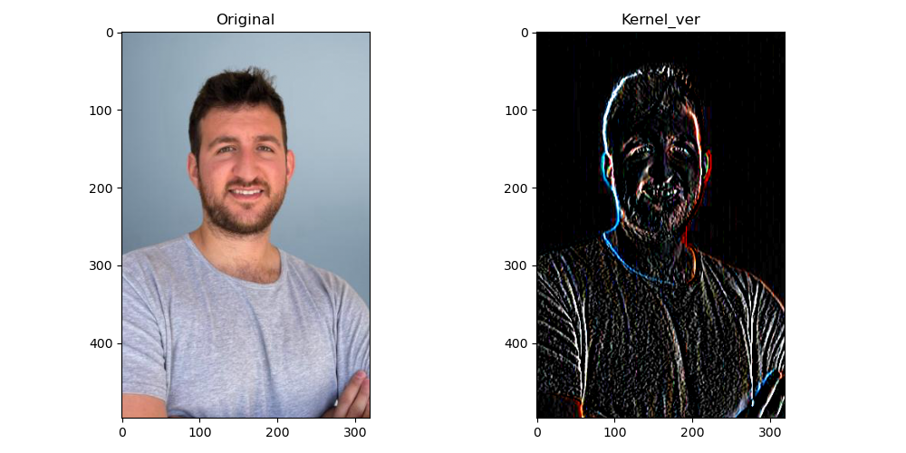
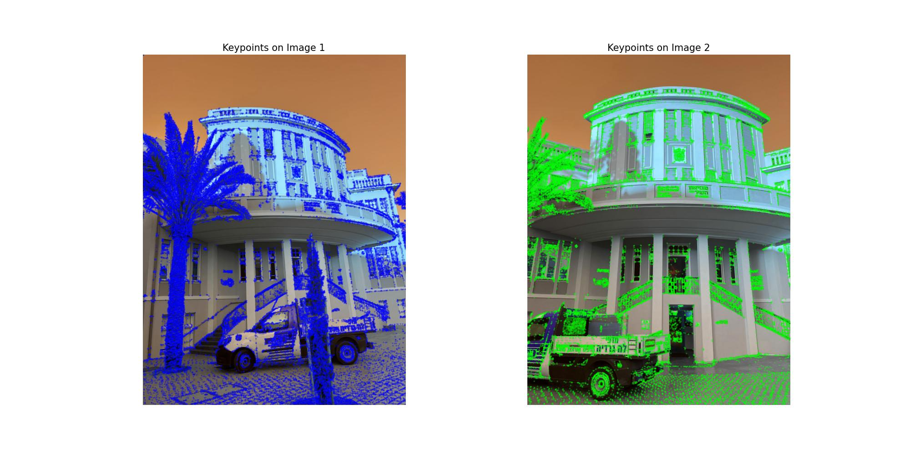
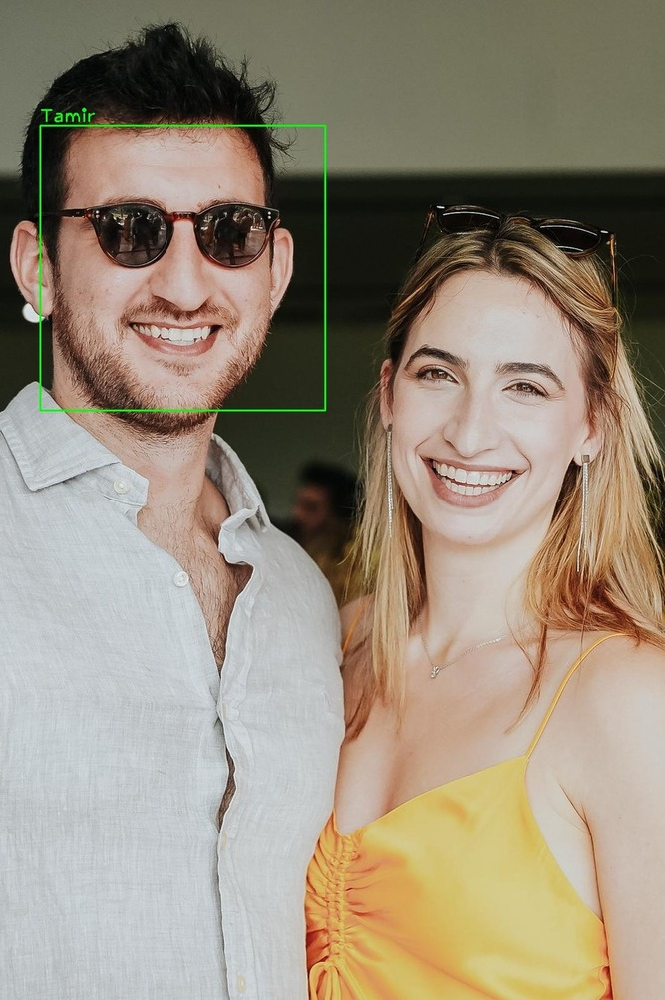

# 🎨 Image Processing and Computer Vision

Welcome to the **Image Processing and Computer Vision** repo! This is my playground for experimenting with image processing concepts learned in class. Mostly basics like image manipulation, face detection, segmentation, and object recognition. 🚀

This repo main use is for me to adopt best Git practices. 🔍

## Visual Examples

  
  
  

